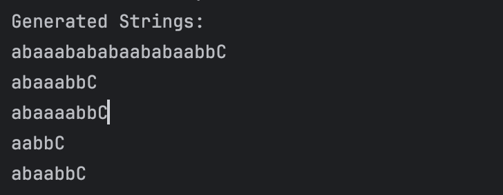
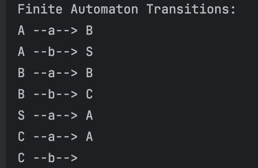
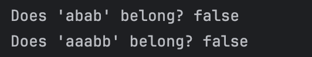

# Intro to formal languages. Regular grammars. Finite Automata.

### Course: Formal Languages & Finite Automata
### Author: Cătălina Siminiuc
### Group: FAF-231

----

## Theory
A **grammar** is a 4-tuple (VN, VT, P, S), where:
1. **VN** - set of non-terminal symbols.
2. **VT** - set of terminal symbols.
3. **P** - set of production rules.
4. **S** - start symbol.

A **regular grammar** follows the format:
- A → aB (left-regular) or A → Ba (right-regular), with terminal symbols (`a, b`) and non-terminal transitions (`A, B`).

A **finite automaton (FA)** is defined as a 5-tuple (Q, Σ, δ, q0, F):
1. **Q** - set of states.
2. **Σ** - alphabet (set of terminal symbols).
3. **δ** - transition function mapping (state, input) → next state.
4. **q0** - initial state.
5. **F** - set of final states.

The equivalence between **regular grammars and finite automata** allows conversion between these models.

## Objectives:
- Define and implement a regular grammar based on **Variant 28**.
- Implement a function to generate **5 valid words** from the grammar.
- Convert the grammar into a **finite automaton (FA)**.
- Implement a function to validate if a string belongs to the FA language.

## Implementation

### Given Grammar (Variant 28)
- **VN** = {S, A, B, C}
- **VT** = {a, b}
- **P** = {
  S → aA  
  A → bS | aB  
  B → bC | aB  
  C → aA | b  
  }
- **Start Symbol** = S

### Implementation Structure
#### `Grammar` Class
- Stores **VN, VT, P, S**.
- Implements `generateString()` to generate **valid words** using random derivation.
- Implements `toFiniteAutomaton()` to convert the grammar into an FA.

#### `FiniteAutomaton` Class
- Defines **Q, Σ, δ, q0, F**.
- Implements `stringBelongToLanguage(String input)` to check if a string is valid.

### Code Snippets
#### **Generating 5 Words from the Grammar**
```java
for (int i = 0; i < 5; i++) {
    System.out.println(grammar.generateString());
}
```

#### **Converting Grammar to Finite Automaton**
```java
FiniteAutomaton fa = grammar.toFiniteAutomaton();
```

#### **Checking if a String Belongs to FA**
```java
System.out.println("Does 'abab' belong? " + fa.stringBelongToLanguage("abab"));
System.out.println("Does 'aaabb' belong? " + fa.stringBelongToLanguage("aaabb"));
```

## Results & Screenshots
### **Generated Words:**


### **Finite Automaton:**


### **String Verification Output:**


## Conclusion
- Successfully implemented **Grammar** and **Finite Automaton**.
- Demonstrated **equivalence between grammars and FA**.
- **Future improvements:** Add visualization tools for better understanding.

## References
1. Regular grammar - [Wikipedia](https://en.wikipedia.org/wiki/Regular_grammar)
2. Introduction to Finite Automata - [GeeksforGeeks](https://www.geeksforgeeks.org/introduction-to-finite-automata/)
3. Lecture notes
